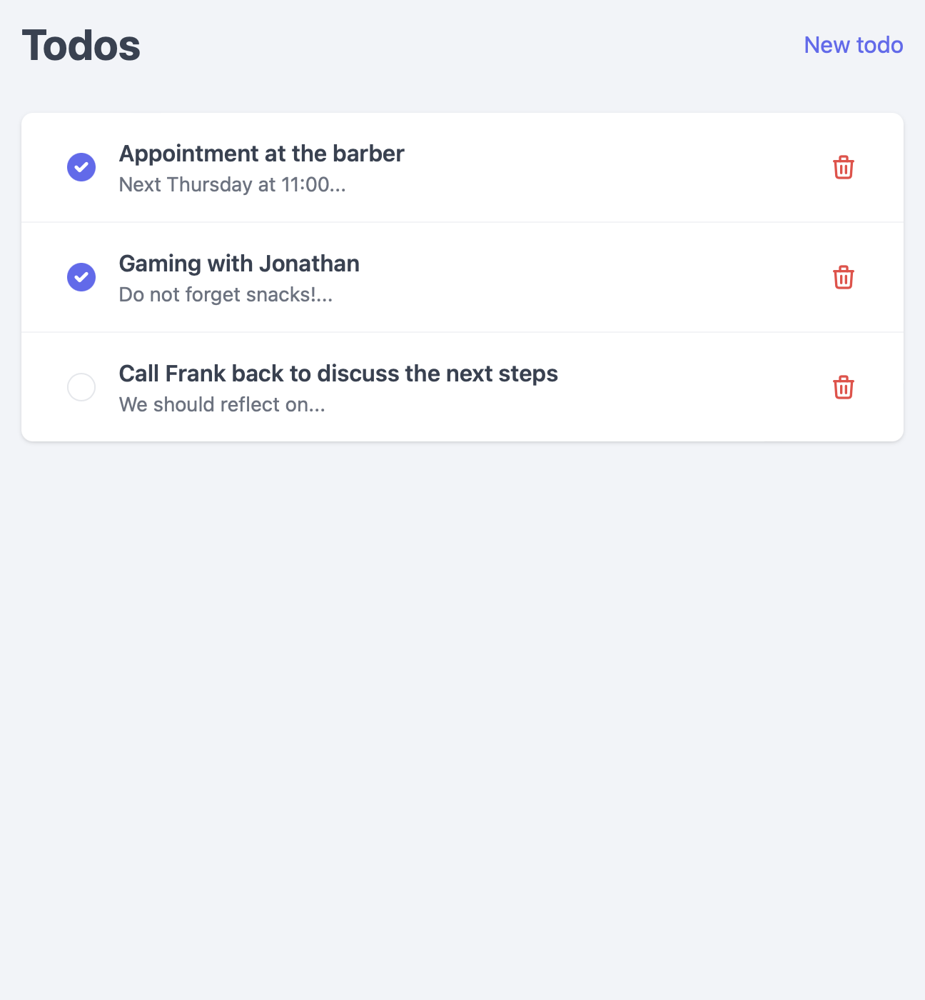

# todo-app

Full-stack todo application with authentication. Built with React, Express, Postgres, and Nginx.

App should be accessible through : 

- https://domain (NGINX Proxy for NODE SERVER)
- http://domain:3000 (NODE SERVER)

Create a microservices architecture through docker-compose using 4 services

- client (code in ./client)
- api (code in ./server)
- database (use postgres)
- proxy (use nginx)

You must configure the services, ports, and database information for the app to work correctly. Read the code to see what ports are used. NGINX should be on port `80`. The default port for POSTGRES is `5432`.

You will have to write a good NGINX config file.
